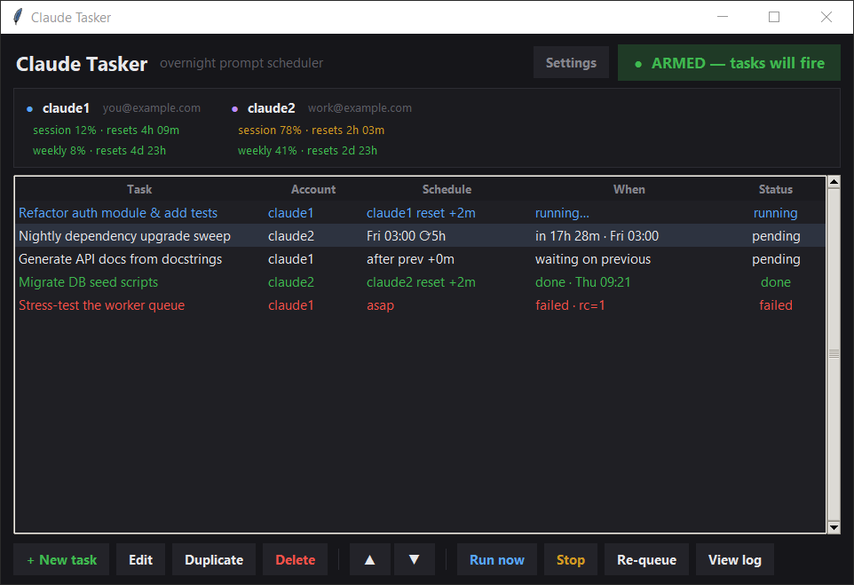
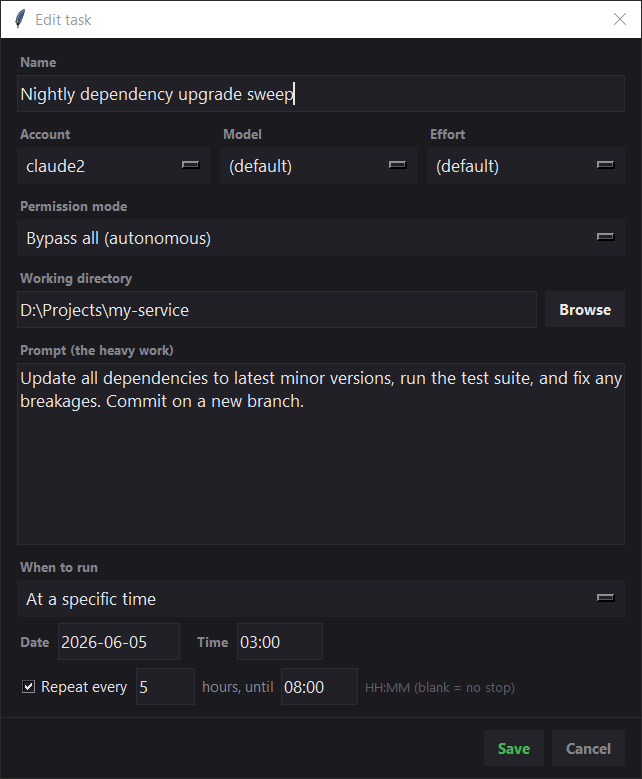
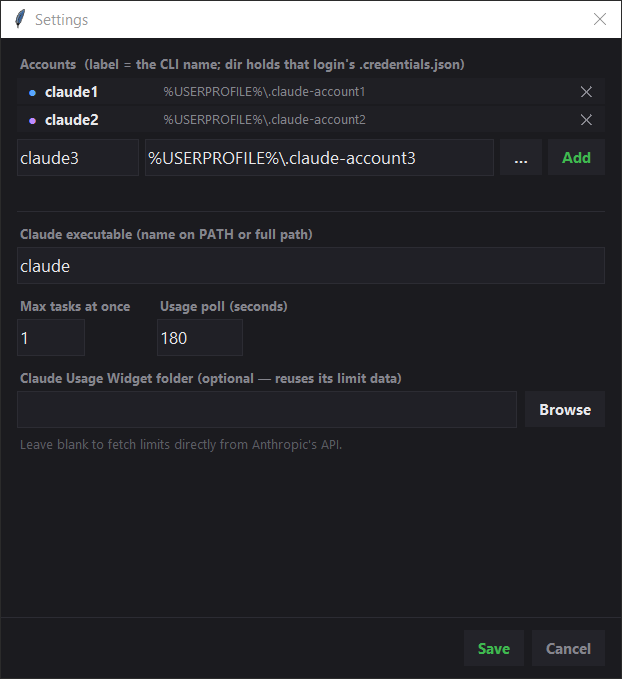

# Claude Tasker

A small Windows desktop app that schedules heavy **Claude Code CLI** prompts to
run unattended — e.g. while you sleep — so a freshly-reset **session (5-hour)**
limit gets *used* instead of sitting idle. Queue prompts, pick the account, and
fire them at a set time or **right when the limit resets**.



For each account it sets `CLAUDE_CONFIG_DIR`, runs `claude -p` headless, and
logs every run. It shows live **session (5h)** and **weekly (7d)** usage with
reset countdowns, read from the same OAuth endpoints Claude Code itself uses —
so it works **standalone**, with nothing else installed.

> **Privacy:** everything runs locally. Tasker talks only to Anthropic's own API
> (the endpoints Claude Code uses) with your existing local login. No e-mails,
> tokens, or usage data go anywhere else, and nothing personal is stored in this
> repository — `settings.json`, `tasks.json`, and `logs/` are created locally on
> first run and are git-ignored.

Pure standard library — `tkinter` + `urllib` + `subprocess`. No `pip install`.

---

## Requirements

- Windows
- **Python 3.11+** (standard library only)
- [Claude Code](https://claude.com/claude-code) installed and logged in at least once

## Install & run

```powershell
git clone https://github.com/PanLipton/claude-tasker.git
cd claude-tasker
```

Then double-click **`Start Tasker.vbs`** (launches with no console window).

Alternatives:

- **`Start Tasker.bat`**, or
- directly: `pythonw claude_tasker.pyw`

On first run Tasker auto-detects your Claude config directories (`~/.claude`,
`~/.claude-account1`, …) and seeds `settings.json`. Adjust accounts any time via
**Settings**. Keep the window open (minimised is fine) — the scheduler lives
inside it.

---

## How it works

1. **Add a task** — name, account, working directory, the prompt (your heavy
   work), a permission mode, optional model + effort, and a schedule.

   

2. **Arm** the app (top-right toggle). Tasks fire **only** while **ARMED**, so
   adding/editing while *paused* can never start anything by accident.
3. The scheduler checks every few seconds and starts due tasks, respecting
   *Max tasks at once* in Settings (default `1` → a true sequential queue; raise
   it to run e.g. `claude1` and `claude2` in parallel).
4. Each run is `claude -p "<prompt>"` with `CLAUDE_CONFIG_DIR` pointed at the
   chosen account, launched hidden, output streamed to `logs/<id>.log`.

### Schedule types

| Type | Fires |
|------|-------|
| **As soon as armed** | immediately once armed |
| **At a specific time** | a date + `HH:MM` (e.g. tonight 03:00) |
| **When session limit resets** | shortly after the chosen account's 5h limit resets — the core "use the fresh window" mode |
| **After the previous task** | when the task above it in the list finishes (+ optional delay) — chain a queue |

**Repeat every N hours until HH:MM** lets one task ride several reset windows
across the night (the 5h session window resets ~every 5 hours).

### Permission modes

Unattended agent work can't stop to ask, so:

- **Bypass all (autonomous)** — `--dangerously-skip-permissions`. The default,
  and what overnight heavy work needs. Only point tasks at directories you trust.
- **Accept edits only** — auto-approves file edits but still blocks on other
  tools (likely to hang on shell commands; not ideal unattended).
- **Default (ask)** — interactive; for unattended runs it just hangs. Avoid.

You can also set an optional **model** (`opus`/`sonnet`/`haiku`) and **effort**
level (`low`…`max`, passed as `--effort`) per task.

### Buttons

- **Run now** — start the selected task immediately, ignoring its schedule.
- **Stop** — kill a running task's process tree (`taskkill /T /F`).
- **Re-queue** — put a done/failed task back to *pending*.
- **View log** — live, auto-following tail of that task's log.
- **▲ / ▼** — reorder (matters for *After the previous task*).

`Ctrl+A` selects all in any text field.

---

## Accounts

Manage accounts in **Settings**: each has a **label** (the CLI name, e.g.
`claude1`) and a **config dir** (the folder holding that login's
`.credentials.json`). Add with the inline form, remove with the **✕**.



### Running several Claude accounts on one computer

Claude Code picks its login from the **`CLAUDE_CONFIG_DIR`** environment variable
(default `%USERPROFILE%\.claude`). To keep separate logins side by side, give
each its own config directory.

**1. (Optional) make a launcher per account** in a folder on your `PATH`, e.g.
`%USERPROFILE%\.local\bin`, so you can also use them from a terminal:

```powershell
$bin = "$env:USERPROFILE\.local\bin"
New-Item -ItemType Directory -Force $bin | Out-Null

@"
@echo off
set "CLAUDE_CONFIG_DIR=%USERPROFILE%\.claude-account1"
claude %*
"@ | Set-Content -Encoding ascii "$bin\claude1.bat"

@"
@echo off
set "CLAUDE_CONFIG_DIR=%USERPROFILE%\.claude-account2"
claude %*
"@ | Set-Content -Encoding ascii "$bin\claude2.bat"

setx PATH "$env:PATH;$env:USERPROFILE\.local\bin"
```

**2. Log in to each account** (in a new terminal so `PATH` is fresh):

```powershell
claude1      # then /login  and sign in with your first account
claude2      # then /login  and sign in with your second account
```

Each `/login` writes credentials into that account's own config directory, so
the logins never collide. *(Tasker sets `CLAUDE_CONFIG_DIR` itself per task — the
`.bat` launchers are only for your own terminal use.)*

**3. Add the accounts in Tasker → Settings**: label `claude1`, dir
`%USERPROFILE%\.claude-account1`, and likewise for `claude2`.

> Don't want to do this by hand? Open this folder in **Claude Code** and ask:
> *"set me up with two Claude accounts and configure Claude Tasker for both."*
> The steps above are exactly what it needs.

---

## Optional: Claude Usage Widget integration

Tasker is fully standalone, but if you also run the companion
**[Claude Usage Widget](https://github.com/PanLipton/claude-usage-widget)** —
an always-on-top widget showing the same limits — point **Settings → Claude
Usage Widget folder** at its directory. Tasker will reuse the numbers the widget
already polled (matched by config directory) instead of making its own API
calls, and fall back to direct fetching for any account the widget doesn't cover.
Same concept, same OAuth endpoints; the two share nicely.

## How the limit data is fetched

| Purpose | Request |
|---|---|
| Limit usage | `GET https://api.anthropic.com/api/oauth/usage` |
| Account e-mail | `GET https://api.anthropic.com/api/oauth/profile` |
| Token refresh | `POST https://console.anthropic.com/v1/oauth/token` |

Access tokens are read from each account's `<config_dir>\.credentials.json`.
When a token is about to expire (~8h) Tasker refreshes it and writes it back to
the same file, so Claude Code and Tasker stay in sync. The usage endpoint is
rate-limited per account, so direct polling defaults to 180s.

## Autostart with Windows (optional)

Press `Win+R`, type `shell:startup`, and drop a shortcut to **`Start Tasker.vbs`**
into that folder.

## Files

| File | Purpose |
|---|---|
| `claude_tasker.pyw` | the app |
| `Start Tasker.vbs` / `.bat` | launchers (`.vbs` = no console flash) |
| `settings.json` | accounts, claude binary, concurrency *(git-ignored)* |
| `tasks.json` | your saved queue *(git-ignored)* |
| `logs/` | one log file per task run *(git-ignored)* |

## Notes & limits

- Tasks are **one-shot** unless *Repeat* is set; a finished task stays in the
  list (re-queue or edit to run again).
- Closing the window stops the scheduler. Any *already-running* `claude`
  processes keep going in the background but won't be tracked once the GUI is
  gone — you'll be warned on quit.
- A `running` status left over from a crash is marked `failed` on next start, so
  nothing is silently assumed to still be alive.

## License

[MIT](LICENSE).

---
---

# Claude Tasker — Українською

Невеликий desktop-застосунок для Windows, що планує запуск **важких промптів
Claude Code CLI** без нагляду — наприклад поки ви спите — щоб щойно скинутий
**сесійний (5-годинний)** ліміт *використовувався*, а не простоював. Складайте
чергу промптів, обирайте акаунт і запускайте їх у заданий час або **щойно ліміт
скидається**.

Для кожного акаунта застосунок виставляє `CLAUDE_CONFIG_DIR`, запускає
`claude -p` headless і логує кожен запуск. Він показує живе використання
**сесійного (5г)** і **тижневого (7д)** лімітів зі зворотним відліком до ресету,
читаючи ті самі OAuth-ендпоінти, що й Claude Code — тож працює **самостійно**,
без жодних додаткових програм.


> **Приватність:** усе працює локально. Tasker звертається лише до API Anthropic
> із вашим локальним логіном. Жодні дані нікуди більше не передаються; у
> репозиторії немає особистих даних — `settings.json`, `tasks.json` і `logs/`
> створюються локально й не потрапляють у git.

Лише стандартна бібліотека — `tkinter` + `urllib` + `subprocess`.

## Вимоги

- Windows, **Python 3.11+** (нічого встановлювати)
- Встановлений Claude Code, у який ви хоча б раз увійшли

## Запуск

```powershell
git clone https://github.com/PanLipton/claude-tasker.git
cd claude-tasker
```

Далі подвійний клік на **`Start Tasker.vbs`** (без вікна консолі), або
`Start Tasker.bat`, або `pythonw claude_tasker.pyw`. Під час першого запуску
Tasker сам знаходить каталоги конфігурації Claude (`~/.claude`,
`~/.claude-account1`, …) і створює `settings.json`. Акаунти будь-коли
редагуються через **Settings**. Тримайте вікно відкритим (можна згорнути) —
планувальник живе всередині нього.

## Як це працює

1. **Додайте задачу** — назва, акаунт, робоча тека, промпт (важка робота), режим
   дозволів, опційно модель + effort, і розклад.
2. **Озбройте** застосунок (тумблер угорі справа). Задачі спрацьовують **лише**
   коли **ARMED** — тож редагування у стані *paused* нічого не запустить.
3. Планувальник кожні кілька секунд запускає задачі, час яких настав, з огляду на
   *Max tasks at once* (типово `1` → справжня послідовна черга; підніміть, щоб
   ганяти `claude1` і `claude2` паралельно).
4. Кожен запуск = `claude -p "<промпт>"` з `CLAUDE_CONFIG_DIR` обраного акаунта,
   прихований, лог у `logs/<id>.log`.

### Типи розкладу

| Тип | Спрацьовує |
|-----|------------|
| **As soon as armed** | одразу після озброєння |
| **At a specific time** | дата + `HH:MM` (напр. сьогодні 03:00) |
| **When session limit resets** | щойно скинеться 5-год ліміт обраного акаунта — головний режим «використати свіже вікно» |
| **After the previous task** | коли завершиться задача вище у списку (+ опційна затримка) |

**Repeat every N hours until HH:MM** дозволяє одній задачі проходити кілька вікон
ресету за ніч (сесійне вікно скидається ~кожні 5 годин).

### Режими дозволів

Автономна робота не може зупинятись питати, тож:

- **Bypass all (autonomous)** — `--dangerously-skip-permissions`. Типовий режим,
  потрібний для нічної важкої роботи. Спрямовуйте задачі лише на теки, яким
  довіряєте.
- **Accept edits only** — авто-підтвердження правок файлів, але блокується на
  інших інструментах (ймовірно зависне на shell-командах).
- **Default (ask)** — інтерактивний; без нагляду просто зависне. Уникайте.

Також можна задати **модель** (`opus`/`sonnet`/`haiku`) та рівень **effort**
(`low`…`max`, передається як `--effort`) на кожну задачу.

### Кнопки

- **Run now** — запустити обрану задачу негайно, ігноруючи розклад.
- **Stop** — вбити дерево процесів задачі (`taskkill /T /F`).
- **Re-queue** — повернути завершену/невдалу задачу у *pending*.
- **View log** — живий лог задачі з авто-прокруткою.
- **▲ / ▼** — змінити порядок (важливо для *After the previous task*).

`Ctrl+A` виділяє все в будь-якому полі.

## Акаунти

Керування — у **Settings**: кожен акаунт має **label** (ім'я CLI, напр.
`claude1`) і **config dir** (теку з `.credentials.json` цього логіну). Додавання —
формою, видалення — **✕**.

### Кілька Claude-акаунтів на одному комп'ютері

Claude Code обирає логін за змінною **`CLAUDE_CONFIG_DIR`** (типово
`%USERPROFILE%\.claude`). Щоб мати кілька логінів, кожному дають свій каталог.

**1. (Опційно) лаунчер на акаунт** у теці з `PATH` (напр.
`%USERPROFILE%\.local\bin`), щоб користуватись і з терміналу:

```powershell
$bin = "$env:USERPROFILE\.local\bin"
New-Item -ItemType Directory -Force $bin | Out-Null

@"
@echo off
set "CLAUDE_CONFIG_DIR=%USERPROFILE%\.claude-account1"
claude %*
"@ | Set-Content -Encoding ascii "$bin\claude1.bat"

@"
@echo off
set "CLAUDE_CONFIG_DIR=%USERPROFILE%\.claude-account2"
claude %*
"@ | Set-Content -Encoding ascii "$bin\claude2.bat"

setx PATH "$env:PATH;$env:USERPROFILE\.local\bin"
```

**2. Увійдіть у кожен акаунт** (у новому терміналі):

```powershell
claude1      # далі /login — вхід першим акаунтом
claude2      # далі /login — вхід другим акаунтом
```

**3. Додайте акаунти в Tasker → Settings**: `claude1` →
`%USERPROFILE%\.claude-account1`, `claude2` → `%USERPROFILE%\.claude-account2`.

> Не хочете вручну? Відкрийте цю теку в **Claude Code** і попросіть:
> *«налаштуй мені два Claude-акаунти і Claude Tasker для обох»*.

## Опційно: інтеграція з Claude Usage Widget

Tasker самодостатній, але якщо ви також користуєтесь
**[Claude Usage Widget](https://github.com/PanLipton/claude-usage-widget)** —
вкажіть **Settings → Claude Usage Widget folder** на його теку. Tasker
використає вже опитані віджетом числа (за збігом каталогу конфігурації) замість
власних викликів API, а для решти акаунтів дотягне напряму. Та сама концепція,
ті самі ендпоінти.

## Як беруться дані лімітів

Дані — з тих самих OAuth-ендпоінтів, що й Claude Code
(`/api/oauth/usage`, `/api/oauth/profile`, `/v1/oauth/token`). Токени читаються з
`<config_dir>\.credentials.json` і автоматично оновлюються та **записуються
назад**, тож Claude Code і Tasker лишаються синхронізованими.

## Автозапуск із Windows

`Win+R` → `shell:startup` → покладіть туди ярлик на **`Start Tasker.vbs`**.

## Ліцензія

[MIT](LICENSE).
